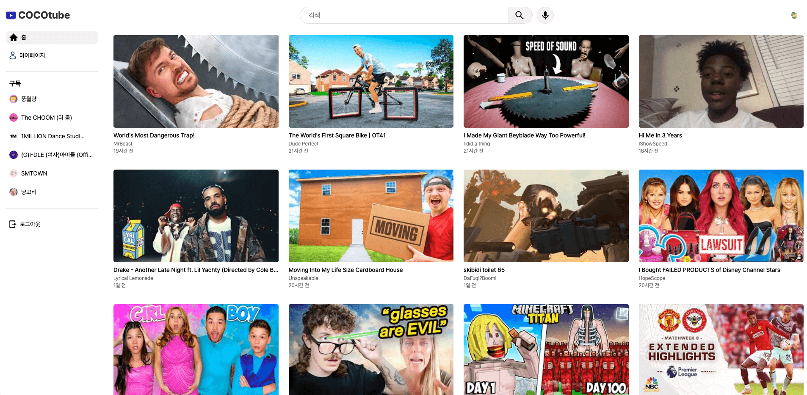
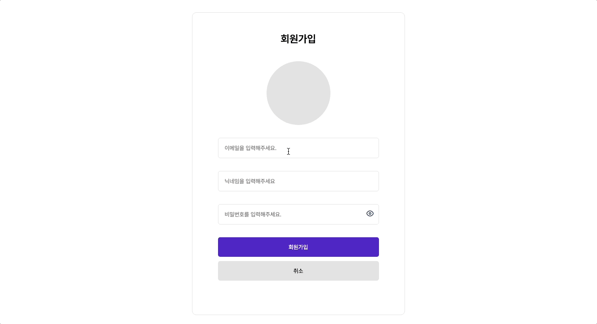
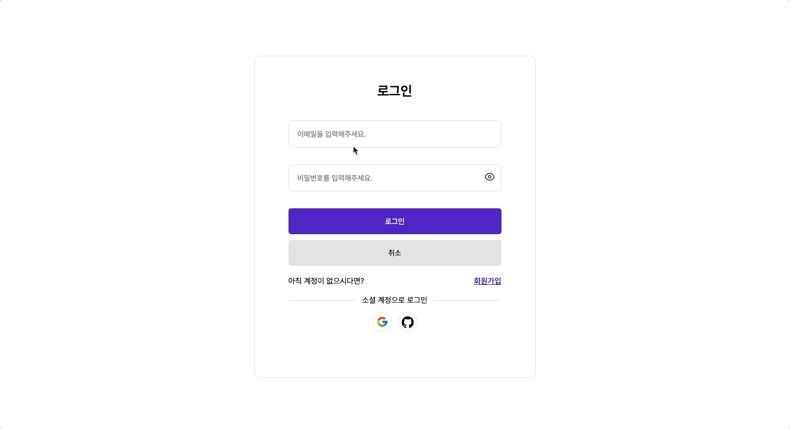
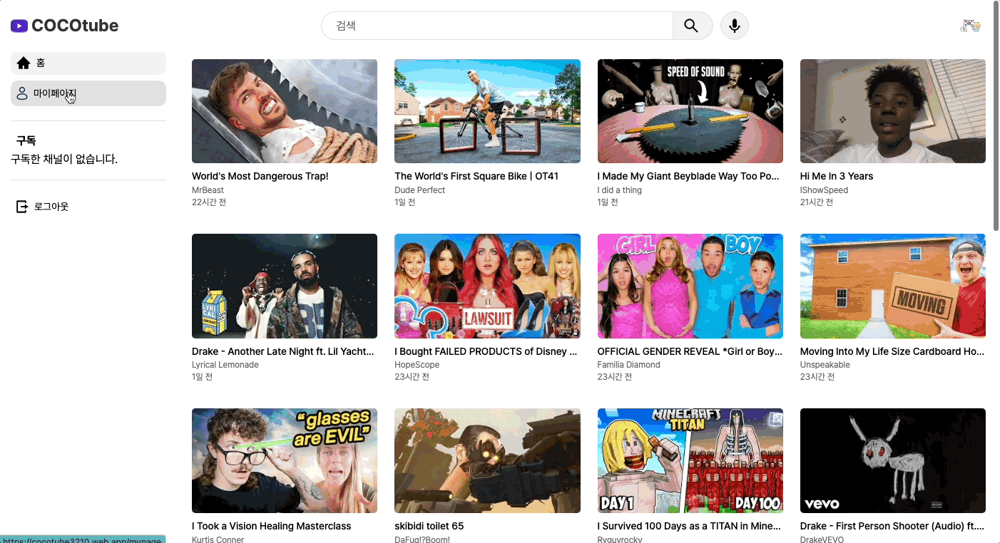

# 🎬 COCOTUBE - 유튜브 프로젝트

## 📝 프로젝트 정보

**[드림코딩 리액트 - 유튜브 프로젝트](https://github.com/chaehaeun/dreamcoding-youtube-clone)** 강의를 수강하며 만든 작업물을 디자인, 기능, 기술 스택을 추가하여 다시 작업한 개인프로젝트입니다.

### 프로젝트 개요

- **주제** : 유튜브 클론 프로젝트
- **작업 기간** : 2023.08.07 ~ 2023.10.08
- **분류** : 개인 프로젝트

### 주요 구현 기능

- firebase 로그인, 회원가입, 로그아웃, 회원탈퇴
- 구글, 깃허브 소셜 로그인
- 마이페이지 (좋아요 누른 영상 조회, 내 정보 수정)
- 영상 좋아요, 채널 구독
- 채널 페이지 조회
- 동영상 검색
- 음성 인식 검색
- 검색 필터링 기능
- 영상 댓글 조회
- 무한 스크롤
- 반응형웹

 

## 🚀 배포 링크

🚨 **프로젝트에 사용된 Youtube Data Api v3 의 경우 하루 무료 사용량이 제한되어 있어 다양한 검색 요청이 들어가게 되면 사용량 초과로 인해 검색이 되지 않을 수 있습니다.**

사용량 초과로 인해 배포 페이지 서비스가 제한적인 경우 불편하시더라도 데모 영상을 확인해주시면 감사하겠습니다.

**[COCOTUBE 배포 주소로 이동](https://cocotube3210.web.app/)**

 

## 🛠 사용 기술 및 도구

### Develop

        

### Deploy

 

## 🎥 데모 영상

 

## ✏️ 구현 내용

### Home

| Home                       |
| -------------------------- |
|  |

### SignIn / SignUp

| 회원가입                       |
| ------------------------------ |
|  |

| 로그인                         |
| ------------------------------ |
|  |

### My Page

| 마이페이지                     |
| ------------------------------ |
|  |

### Search

| 검색                            |
| ------------------------------- |
|  |

### Video Detail

| 비디오 디테일                            |
| ---------------------------------------- |
|  |

### Channel

| 채널                             |
| -------------------------------- |
|  |

### 반응형 웹

| 반응형                                 |
| -------------------------------------- |
|  |
